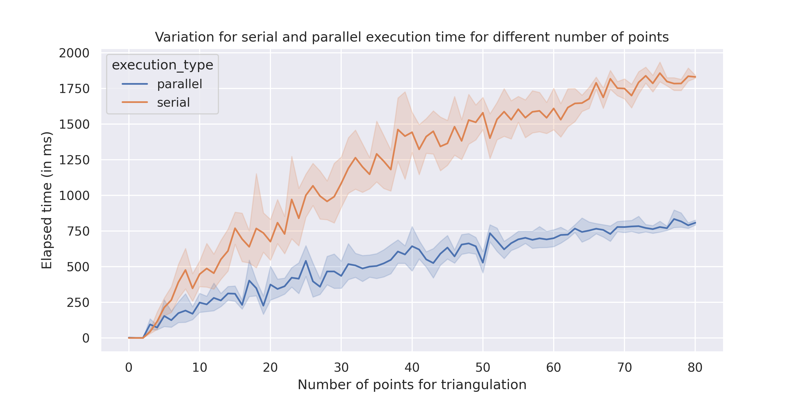
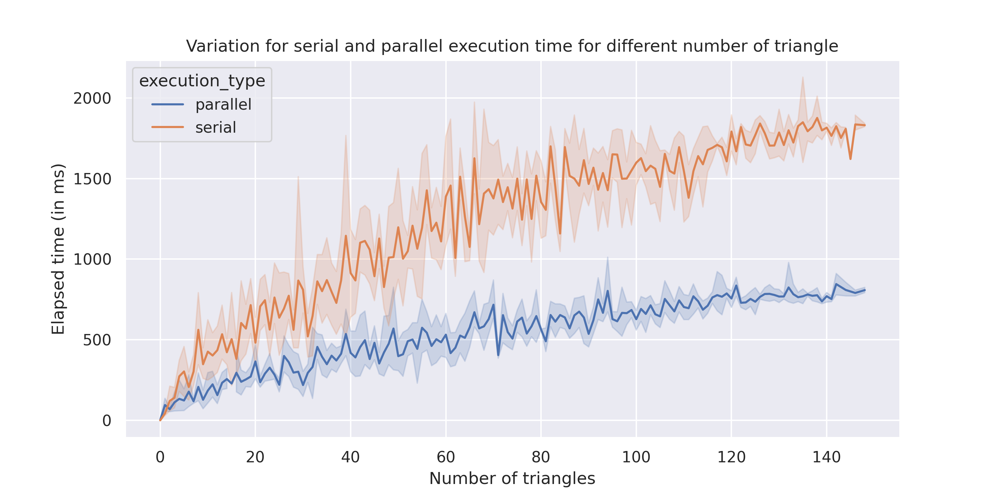
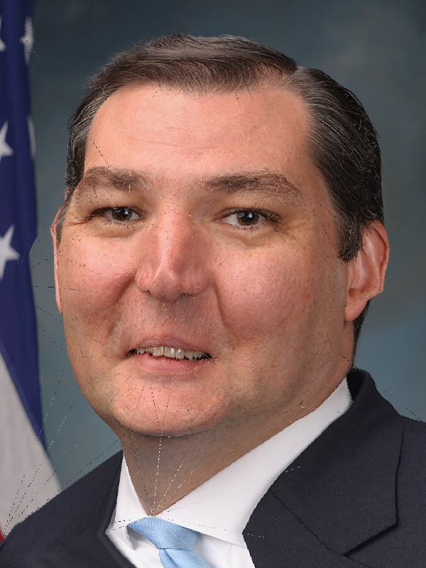
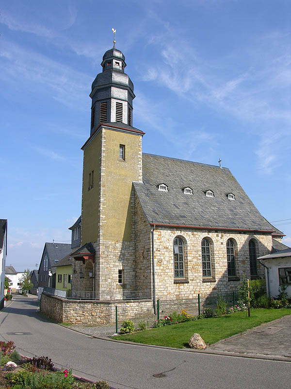
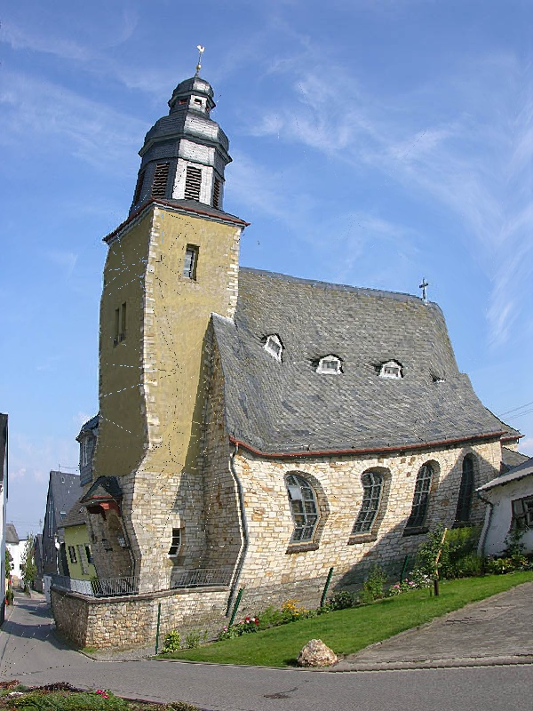
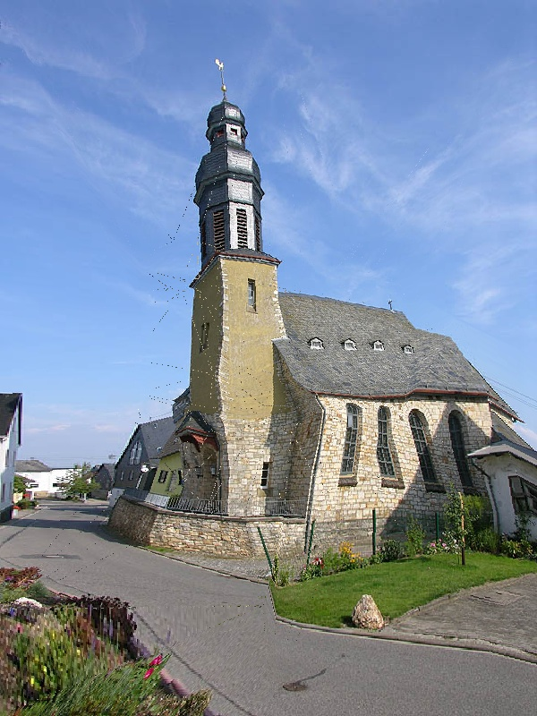
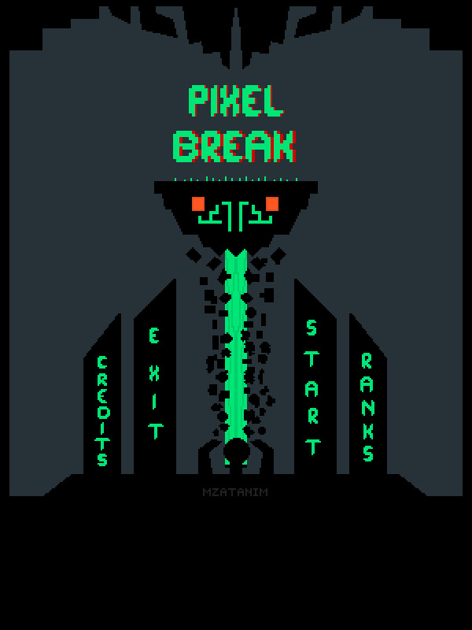
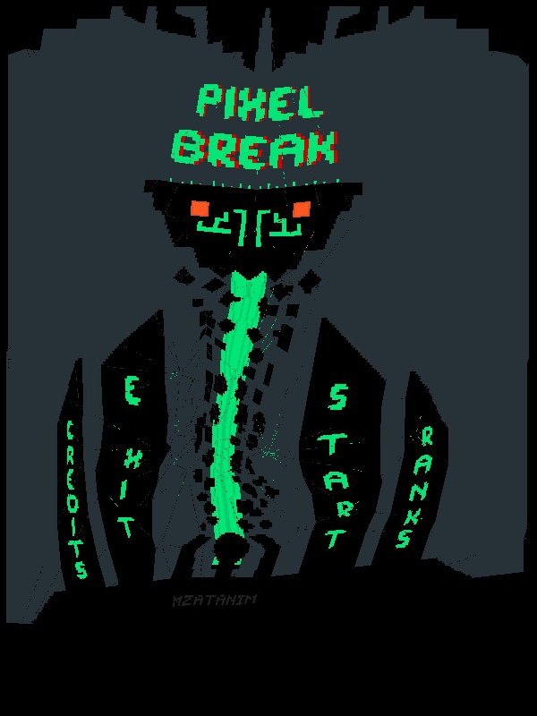
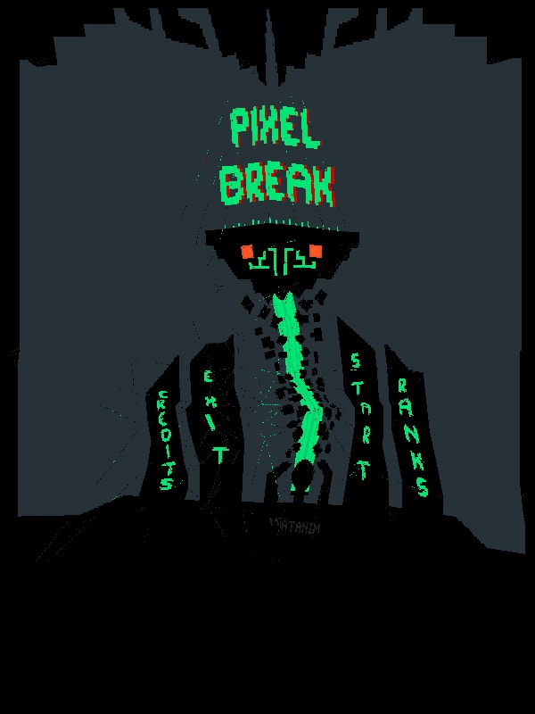

# Parallel Image Morphing by Affine Transformations

### CS61064 - High Perfomance Parallel Programming - OpenMP/MPI Assignment 1

**Utkarsh Patel (18EC35034)**

## Benchmarking Performance

The program is run for different number of points considered in triangulation step 
(hence for different number of triangles). We benchmark the time elapsed while 
executing the parallelizable section (the SECTION here onwards.)




We observe that using OpenMP, performance is increased by nearly **3x**.

## Results

| Original image | Morphed image #1 | Morphed image #2 |
| -------------- | ---------------- | ---------------- |
|  |  |  |
|  |  |  |
|  |  |  |
|  |  |  |
!  |  | 

## Build

To build this repository
```shell
$ make
```

## Generate results

To view results from sample images
```shell
$ bash benchmark.sh DROPOUT_PROB
```
where `DROPOUT_PROB` is the probability of dropping some of the points.